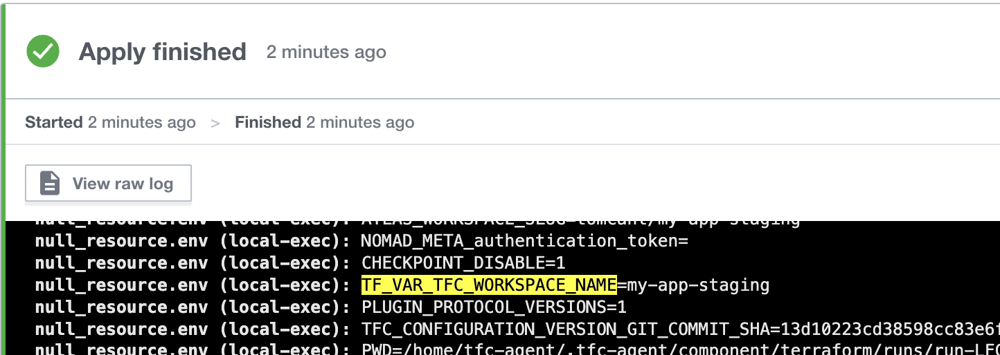

When using Terraform to manage resources across deployment stages (e.g. staging, prod), it can be useful to have the name of the stage for inclusion in resource naming, such as domain names, S3 bucket names, etc.

<!--more-->

Terraform provides [the workspaces feature](https://developer.hashicorp.com/terraform/cloud-docs/workspaces) as a way to maintain multiple versions of a single configuration, so this is ideal for managing collections of resources as deployment stages. However, the feature [behaves differently](https://developer.hashicorp.com/terraform/cloud-docs/workspaces#terraform-cloud-vs-terraform-cli-workspaces) depending on which edition of Terraform you use (OSS/CLI vs Cloud).

A variable containing the name of the current workspace is automatically provided in all editions: `${terraform.workspace}`. When using OSS/CLI its value is either `default` or the name supplied in the last `terraform workspace select ...` command. With workspaces named `staging` and `prod`, for example, this makes the name of the stage readily available for interpolation in resource names. However, at the time of writing, this variable will always be `default` in the Cloud edition, regardless of the chosen workspace.

The reason for this difference stems from how each edition represents a workspace: OSS/CLI uses a separate local directory for each workspace's state; Cloud makes a copy of the entire project per workspace and uses a single "default" directory for each one.

Fortunately, with a bit of experimentation we can replicate the OSS/CLI behaviour in the Cloud edition. By using [the local-exec provisioner](https://developer.hashicorp.com/terraform/language/resources/provisioners/local-exec) we can inspect the environment of the Terraform Cloud container used to plan and apply configuration:

```hcl
resource "null_resource" "env" {
  provisioner "local-exec" {
    command = "env"
  }
}
```

Buried in the output we can see an environment variable containing the full name of the Cloud workspace, `my-app-staging`:



Since it begins `TF_VAR_`, we can read this environment variable into a regular Terraform variable and manipulate it to retrieve the name of the deployment stage:

```hcl
variable "TFC_WORKSPACE_NAME" {}

locals {
  stage = trimprefix(var.TFC_WORKSPACE_NAME, "my-app-")
}
```

Now we can use `${local.stage}` in string interpolations and reflect the behaviour of the OSS/CLI edition.

An alternative approach is to configure your Terraform Cloud workspace to use the "Local" execution mode, as opposed to the default "Remote". You still get some benefits of working with the Cloud edition (e.g. team collaboration and synchronised remote state), but you must run the plan and apply steps manually on your local machine, where you also benefit from the OSS/CLI workspace behaviour. Personally, I still opt for the "Remote" execution mode because I prefer a fully managed solution in which everything is centralised, leaving nothing to the configuration of my personal machine.

Using the `TF_VAR_TFC_WORKSPACE_NAME` environment variable provides a simple workaround for determining the name of the deployment stage based on the name of a Terraform Cloud workspace. Hopefully this post will save someone time in figuring this out themselves!
